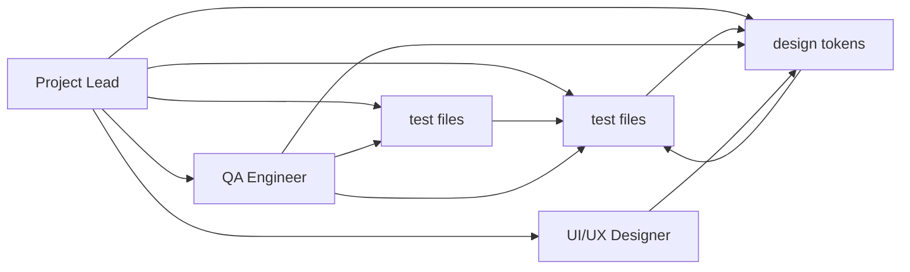

# Project Lead — TAJ Pharmacy v4

> **Role**: Architecture decisions, roadmap, priorities, cross-team coordination.
> **You OWN**: This file, `docs/AGENT-HANDOFF.md`, `docs/agents/_ACTIVE-LOCK.md` (queue management).
> **You NEVER**: Write production source code. You review, plan, and coordinate.

---

## Session Protocol

1. Read this file + `_ACTIVE-LOCK.md` + last 3 entries in `_WORK-LOG.md`
2. Read `docs/AGENT-HANDOFF.md` for full project context
3. Do your work (planning, reviewing, prioritizing)
4. Update this file (flip ⬜→✅, update phase status)
5. Append to `_WORK-LOG.md`
6. Update `_ACTIVE-LOCK.md` (clear session, update queue)

---

## Project Status

**Current Phase**: Phase 1 (Desktop Production Hardening) — ~85% complete
**Maturity Level**: Late Alpha / Early Beta
**Next Milestone**: First customer production readiness

### Phase Progress

| Phase | Name | Status | Key Blocker |
|-------|------|--------|-------------|
| 0 | First Customer Readiness Audit | ⬜ Not started | Need manual walkthrough |
| 1 | Desktop Production Hardening | 🟡 85% complete | Typed errors, file splits, tests |
| 2 | Owner Cloud Dashboard Stabilization | ⬜ Not started | Phase 1 must finish first |
| 3 | SaaS-Ready Tenant/Branch Foundation | ⬜ Not started | Phase 2 must finish first |
| 4 | Multi-Customer Operational Readiness | ⬜ Not started | Phase 3 must finish first |
| 5 | Full SaaS Evolution | ⬜ Not scheduled | After Phase 4 proves business model |

---

## Architecture Decisions Log

| # | Decision | Date | Rationale | Reversible? |
|---|----------|------|-----------|-------------|
| 1 | Tauri 2 + Rust for desktop | 2026-04 | Small binary, native perf, SQLite access | No |
| 2 | SQLite for local DB | 2026-04 | Single-user desktop, no server needed | No |
| 3 | Integer piasters for money | 2026-04 | Avoids floating-point errors | No |
| 4 | Table-snapshot cloud sync | 2026-04 | Simpler than event-sourcing for v1 | Yes (Phase 5 may change) |
| 5 | Additive-only migrations | 2026-04 | Never lose data, safe for production DBs | No |
| 6 | RTL-first CSS (ms/me/ps/pe) | 2026-04 | Arabic-first market | No |
| 7 | Hardcoded tenant/branch IDs | 2026-04 | Acceptable for Phase 1, Phase 3 fixes | Yes (Phase 3) |
| 8 | Multi-agent role file system | 2026-05-06 | Enable multi-model collaboration | Yes |

---

## Critical Issues (P0 — Must Fix Before First Customer)

| # | Issue | Owner | Status | Notes |
|---|-------|-------|--------|-------|
| 1 | Zero automated tests | QA Engineer | ⬜ | Money-handling code with no tests is a liability |
| 2 | Stringly-typed Rust errors | Rust Developer | ⬜ | Can't programmatically handle errors |
| 3 | DB CHECK constraints missing values | Rust Developer | ⬜ | 'recalled' status will silently fail INSERT |
| 4 | PRAGMA foreign_keys not enabled | Rust Developer | ⬜ | Orphan records can accumulate |
| 5 | Secrets in handoff doc | Cloud Engineer | ⬜ | Security risk |
| 6 | No CI/CD pipeline | Project Lead | ⬜ | No automated quality gate |
| 7 | check_permission never called as guard | Rust Developer | ⬜ | Permission system exists but isn't enforced |

---

## High Priority Issues (P1 — Should Fix Before Launch)

| # | Issue | Owner | Status |
|---|-------|-------|--------|
| 1 | pos.rs is 2001 lines (exceeds 800-line rule by 2.5×) | Rust Developer | ⬜ |
| 2 | settings.rs is ~80KB | Rust Developer | ⬜ |
| 3 | cloud_sync.rs is ~68KB | Rust Developer | ⬜ |
| 4 | POS.tsx has 30+ useState hooks | Frontend Dev | ⬜ |
| 5 | POS.tsx is 1209 lines | Frontend Dev | ⬜ |
| 6 | No rate limiting on cloud API | Cloud Engineer | ⬜ |
| 7 | No input validation on cloud API | Cloud Engineer | ⬜ |
| 8 | create_invoice_sale uses English errors | Rust Developer | ⬜ |
| 9 | Hardcoded hex colors in 4+ files | UI/UX Designer | ⬜ |
| 10 | No accessibility audit | UI/UX Designer | ⬜ |

---

## Team Coordination Notes

### Dependencies Between Roles

### Critical Path to v1.0

1. **Rust Dev**: Typed errors → Split files → Fix constraints → Enable FK
2. **QA Engineer**: Unit tests for pos_sale → Integration tests → Cloud API tests
3. **Frontend Dev**: POS useReducer → Split POS.tsx → Delete orphans
4. **UI/UX Designer**: Replace hardcoded colors → StyleGuide → Accessibility
5. **Cloud Engineer**: Input validation → Rate limiting → Secrets → CI/CD
6. **Project Lead**: CI/CD pipeline (after tests exist) → Phase 0 audit

---

## Active Tasks

| # | Task | Priority | Status | Assigned To |
|---|------|----------|--------|-------------|
| 1 | Set up GitHub Actions CI/CD | 🔴 High | ⬜ | Project Lead (after tests) |
| 2 | Conduct Phase 0 readiness audit | 🔴 High | ⬜ | Project Lead |
| 3 | Update AGENT-HANDOFF.md with agent system | 🟡 Medium | ⬜ | Project Lead |

## Completed

- ✅ Full project review conducted (Session 001)
- ✅ Multi-agent system designed and files created (Session 001)
